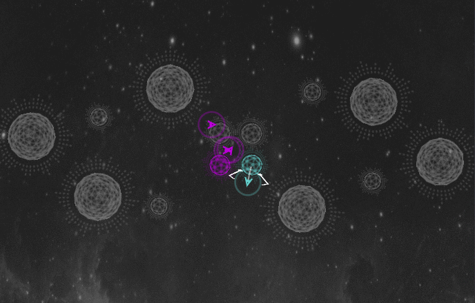

<h1 align="center">
  Halite 2 :rocket: :space_invader: :rocket:
</h1>

Trabalho de Multi Agentes da disciplina de Fundamentos de Sistemas Inteligentes</a>

  
  

  
  
  

## :pencil: Parte 1 – implemente um agente Halite (peso 4)

:heavy_check_mark: Use a versão 2 do Halite; 
:heavy_check_mark: Codifique na linguagem de programação Python3; 
:heavy_check_mark: Você pode importar qualquer biblioteca padrão do Python e biblioteca Halite; 
:heavy_check_mark: Você não pode importar bibliotecas externas (ex.: SKLearn, Pandas, etc); 
:heavy_check_mark: Seu código completo deve estar em um único arquivo Python; 
:heavy_check_mark: Desenvolva seu Agente; 
:heavy_check_mark: Baixe o Halite: https://2017.halite.io/learn-programming-challenge/downloads-and-starter-kits/; 
:heavy_check_mark: Você inicia uma partida com o comando Halite; 
:heavy_check_mark: Na versão padrão, será salvo um replay na pasta replay; 
:heavy_check_mark: Você pode ver seu agente segurando e arrastando o replay para o site: 
https://2017.halite.io/play-programming-challenge; 
:heavy_check_mark: Veja run-game.bat ou run-game.py para informações adicionais sobre o comando; 
:heavy_check_mark: Informações da API e das regras do jogo podem ser encontradas aqui: 
https://2017.halite.io/learn-programming-challenge/ 
https://2017.halite.io/learn-programming-challenge/basic-game-rules/units; 
:heavy_check_mark: Veja a documentação completa para descobrir comandos úteis como
get_surrounding_cardinals(); 
:heavy_check_mark: Batize seu robô. Exemplo, se o seu robô se chama Foo, o arquivo deve ser foo.py (ao invés de
mybot.py) e internamente, o comando game.read(“foo”) deve ser usado; 
:heavy_check_mark: Elabore um relatório detalhando seu agente (detalhes a seguir); 
:heavy_check_mark: Envie o código fonte do seu agente junto com o relatório; 
:heavy_check_mark: Código não compilável/executável anulará o trabalho.

## :pencil: Parte 2 – elabore o relatório (peso 6)

:heavy_check_mark: Seu relatório deve conter no mínimo 800 palavras (use recurso contar Palavras do Word ou
similar); 
:heavy_check_mark: Não há modelo de relatório, você pode definir o modelo que desejar. Tabelas, códigos, pseudo-códigos, listagens, capa, contrapa, etc não contam como palavras; 
:heavy_check_mark: Resultados dos testes explicados na forma de texto também não contam como palavras; 
:heavy_check_mark: Dê uma visão geral sobre a competição Halite; 
:heavy_check_mark: Descreva a estratégia de que seu agente utiliza para coletar Halite. 
:heavy_check_mark: Mostre o resultado de três partidas do seu agente contra ele mesmo e indique a pontuação
atingida; 
:heavy_check_mark: Em relação aos agentes estudados; 
:heavy_check_mark: Indique a arquitetura do seu agente (mais de uma se for o caso) e justifique a resposta; 
:heavy_check_mark: Indique o PEAS do agente; 
:heavy_check_mark: Caracterize o tipo de ambiente no qual ele está inserido; 
:heavy_check_mark: Ao invés do PDF do seu relatório envie o arquivo original (doc, docx, odt, tex, etc) para
contagem de palavras.

## :pencil: Visão geral:

1. Seu agente começa com 5 mil Halite. 
2. Você pode inserir novos navios no tabuleiro gastando Halite. 
3. Você pode inserir novos portos no tabuleiro gastando Halite. 
4. Se dois navios colidirem, eles vão afundar e deixar o Halite coletado sobre o oceano. 
5. Se um dos seus navios estiver perto de um navio adversário ele será “inspirado” pela competição
e coletará mais Halite. 
6. Seu código tem dois segundos para decidir o que os navios farão. As ações serão inseridas em
uma fila de ações. 
  6.1 Caso seu agente demore mais de dois segundos para a decisão, sua pontuação será zerada. 
  6.2 Tenha em mente que o código será rodado em um Intel Core I3. Se acha que seu agente pode
  estourar o tempo nesse equipamento, use um contador de tempo interno na sua lógica para se
  resguardar. 
  6.3 Podem ocorrer deadlocks, em determinadas posições, os navios podem não conseguir decidir
  qual deve ser o primeiro a entrar no porto. Sem tratamento desse tipo, seus navios coletarão bem
  menos halite. 
7. Ações incluem movimentar-se para os pontos cardeais norte (acima), sul, leste, oeste, ficar
parado, transformar o navio em porto, entre outros.

## :pencil: Regras

1. O trabalho é individual. 
2. A competição será feita na próxima aula após a entrega do código fonte dos agentes. 
3. Primeira rodada 
  3.1 Agentes serão sorteados em uma ordem aleatória: 1, 2, 3, ..., n 
  3.2 O agente i fará duas batalhas. Uma batalha contra i–1 e outra contra i+1. Agentes 1 e n são
  casos especiais e se enfrentarão. Obs: essa estratégia de competição se chama Round-Robin. 
  3.4 Cada vitória vale um ponto. 
  3.5 Os dois times com mais pontos irão para a final. 
4. Segunda rodada (final) 
  4.1 Será decidida na melhor de três. 
  4.2 O primeiro lugar receberá 0.5 pontos na média (NF sem contar REC). 
  4.3 O segundo lugar receberá 0.3 pontos na média (NF sem contar REC). 
5. Seu agente deve ser original. Detecção de plágio no agente ou no relatório, mesmo que em
pequenas porções de texto ou código anularão o trabalho. Se estiver em dúvida sobre o que
caracteriza plágio, consulte o professor.

## :pencil: Avaliação

1. Código não compilável **anulará o trabalho**; 
2. Detecção de plágio, mesmo que em pequenas porções de texto ou código **anularão o trabalho**. 
Se estiver em dúvida sobre o que caracteriza plágio, consulte o professor.